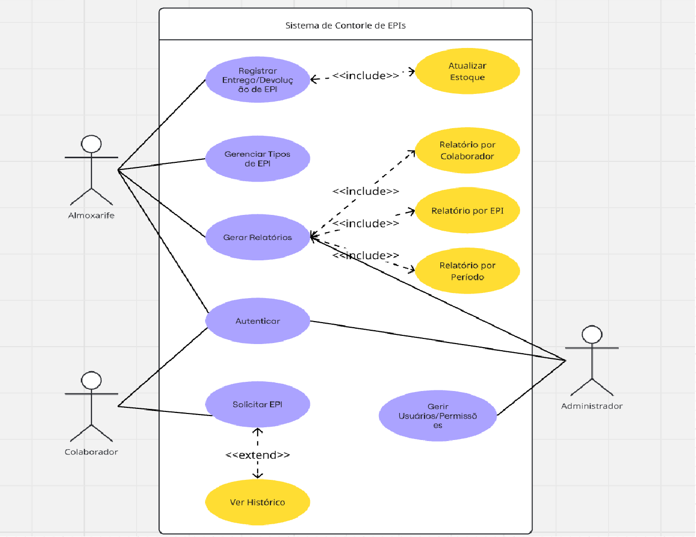

# Sistema de Controle de EPI

Sistema web desenvolvido em **Django + Python** para gerenciar o ciclo de vida dos **EPIs (Equipamentos de Proteção Individual)** em uma organização.  
O sistema permite que **colaboradores**, **almoxarifes** e **administradores** solicitem, entreguem, cadastrem e acompanhem a distribuição de EPIs.

---

## Indice

- [Visão Geral](#visão-geral)
- [Perfis de Usuário](#perfis-de-usuário)
- [Funcionalidades Principais](#funcionalidades-principais)
- [Fluxo de Funcionamento](#fluxo-de-funcionamento)
- [Modelos de Dados](#modelos-de-dados)
- [Telas Mínimas](#telas-mínimas)
- [Diagramas](#diagramas)
- [Requisitos](#requisitos)
  - [Requisitos Funcionais (RF)](#requisitos-funcionais-rf)
  - [Requisitos Não Funcionais (RNF)](#requisitos-não-funcionais-rnf)
  - [Regras de Negócio (RN)](#regras-de-negócio-rn)
- [Instalação e Execução](#instalação-e-execução)
- [Próximos Passos](#próximos-passos)

---

## Visão Geral

O sistema foi projetado para **controlar a distribuição de EPIs**, garantindo rastreabilidade e organização.  
De forma simplificada, ele permite:

- Cadastro de tipos de EPIs com validade, vida útil e estoque.
- Solicitação de EPIs por parte dos colaboradores.
- Registro de entregas feitas pelo almoxarife.
- Relatórios básicos para acompanhamento da distribuição.

[🔝 Voltar ao Índice](#indice)

---

## Perfis de Usuário

- **Administrador**

  - Gerencia usuários e acessos.
  - Acompanha relatórios globais.

- **Almoxarife**

  - Cadastra EPIs.
  - Atende solicitações de entrega.
  - Controla o estoque.

- **Colaborador**
  - Solicita EPIs necessários para sua função.
  - Consulta histórico de solicitações e entregas.

[🔝 Voltar ao Índice](#indice)

---

## Funcionalidades Principais

### Cadastro de EPIs (Almoxarife)

- Criar e editar tipos de EPIs.
- Informações: nome, categoria, tamanhos, validade, vida útil, foto.
- Controle de **estoque disponível**.

### Solicitação de EPIs (Colaborador)

- Solicitação feita via painel.
- Acompanha o status (**pendente** ou **atendida**).

### Entrega de EPIs (Almoxarife)

- Visualiza solicitações pendentes.
- Registra a entrega realizada.
- Estoque é atualizado automaticamente.

### Relatórios

- Por **colaborador**: histórico de entregas realizadas.
- Por **EPI**: quantidades entregues e saldo em estoque.
- Por **período/data**: total entregue em um intervalo definido.
- Exportação simples (CSV/PDF opcional).

[🔝 Voltar ao Índice](#indice)

---

## Fluxo de Funcionamento

1. **Colaborador** acessa o sistema e solicita um EPI.
2. **Almoxarife** recebe a solicitação, confirma a entrega e atualiza o estoque.
3. O sistema registra a movimentação e mantém o histórico.
4. **Administrador ou gestor** pode gerar relatórios filtrados (por colaborador, EPI ou período).

[🔝 Voltar ao Índice](#indice)

---

## Modelos de Dados

Estrutura inicial de tabelas no Django:

- **TipoEPI**  
  Nome, categoria, tamanho, validade, vida útil, foto, quantidade em estoque.

- **SolicitacaoEPI**  
  Colaborador, EPI solicitado, quantidade, data, status (pendente/atendida).

- **EntregaEPI**  
  Solicitação vinculada, almoxarife responsável, data da entrega, quantidade.

[🔝 Voltar ao Índice](#indice)

---

## Telas Mínimas

- **Login/Logout** (autenticação padrão Django).
- **Dashboard** por perfil:
  - Colaborador → solicitações e histórico.
  - Almoxarife → cadastro de EPIs, solicitações pendentes, estoque.
  - Administrador → relatórios e gestão de usuários.
- **Relatórios** → filtros por colaborador, EPI ou período.

[🔝 Voltar ao Índice](#indice)

---

## Diagramas

### Caso de Uso



### Entidades e Relacionamento


[🔝 Voltar ao Índice](#indice)

---

## Requisitos

### Requisitos Funcionais (RF)

1. O sistema deve permitir que **colaboradores** solicitem EPIs.
2. O sistema deve permitir que **almoxarifes** cadastrem tipos de EPIs.
3. O sistema deve permitir que **almoxarifes** registrem a entrega de EPIs.
4. O sistema deve gerar relatórios de entregas por colaborador, por EPI e por período.
5. O sistema deve atualizar automaticamente o estoque após cada entrega.

### Requisitos Não Funcionais (RNF)

1. O sistema deve ser desenvolvido em **Django + Python**.
2. O banco de dados deve ser relacional (SQLite ou MySQL).
3. O sistema deve possuir autenticação baseada em usuários do Django.
4. O sistema deve possuir interface web responsiva e simples.
5. O sistema deve permitir exportação de relatórios em CSV ou PDF.

### Regras de Negócio (RN)

1. Cada entrega de EPI deve estar vinculada a uma solicitação feita por um colaborador.
2. O estoque não pode ser negativo após uma entrega.
3. Apenas **almoxarifes** podem registrar entregas de EPIs.
4. Apenas **administradores** podem cadastrar e gerenciar usuários.
5. Um colaborador só pode solicitar EPIs previamente cadastrados no sistema.

[🔝 Voltar ao Índice](#indice)

---

## Instalação e Execução

### Pré-requisitos

- Python **3.10+**
- Pipenv ou Virtualenv (opcional)
- Git

### Passo a passo

```bash
# Clonar o repositório
git clone https://github.com/seu-usuario/sistema-controle-epi.git
cd sistema-controle-epi

# Criar e ativar ambiente virtual (opcional, mas recomendado)
python -m venv venv
source venv/bin/activate   # Linux/Mac
venv\Scripts\activate      # Windows

# Instalar dependências
pip install -r requirements.txt

# Criar e aplicar migrações
python manage.py makemigrations
python manage.py migrate

# Criar superusuário (admin)
python manage.py createsuperuser

# Rodar o servidor
python manage.py runserver
```

### A aplicação estará disponível em:

👉 [http://localhost:8000](http://localhost:8000)

[🔝 Voltar ao Índice](#indice)

---

## Próximos Passos

- Documentar **Casos de Uso** detalhados.
- Criar os diagramas (**Casos de Uso** e **DER**).
- Implementar os primeiros testes automatizados.
- Adicionar relatórios exportáveis (**CSV/PDF**).

[🔝 Voltar ao Índice](#indice)

---

## Estilos e UI

O frontend utiliza uma estilização moderna e clean com CSS dividido por responsabilidade:

- static/css/reset.css, variables.css, base.css, layout.css, components.css
- static/css/pages/ (estilos específicos por página como dashboard.css, forms.css, tables.css)

Os templates foram atualizados para usar classes semânticas (card, grid, table, form-grid, btn).  
A navbar é responsiva e possui um toggle simples implementado em static/js/app.js.

Para ajustes de tema (cores, espaçamentos), altere static/css/variables.css.

[🔝 Voltar ao Índice](#indice)
