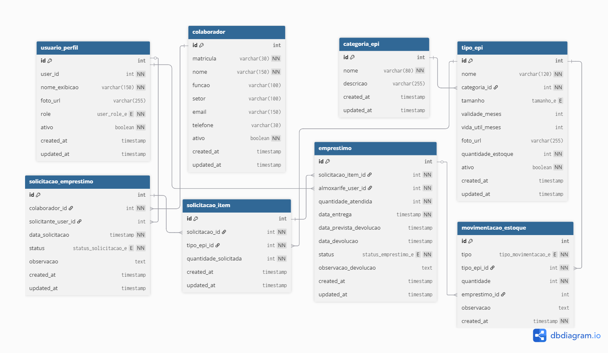

# Sistema de Controle de EPI

Sistema web desenvolvido em **Django + Python** para gerenciar o ciclo de vida dos **EPIs (Equipamentos de Proteção Individual)** em uma organização de construção civil.  
O sistema garante rastreabilidade, conformidade com normas de segurança, usabilidade e controle de estoque, permitindo auditoria e acompanhamento detalhado.

---

## Índice

- [Visão Geral](#visão-geral)
- [Perfis de Usuário](#perfis-de-usuário)
- [Funcionalidades Principais](#funcionalidades-principais)
- [Fluxo de Funcionamento](#fluxo-de-funcionamento)
- [Modelos de Dados](#modelos-de-dados)
- [Telas Mínimas](#telas-mínimas)
- [Diagramas](#diagramas)
- [Requisitos](#requisitos)
  - [Requisitos Funcionais (RF)](#requisitos-funcionais-rf)
  - [Requisitos Não Funcionais (RNF)](#requisitos-não-funcionais-rnf)
  - [Regras de Negócio (RN)](#regras-de-negócio-rn)
- [Instalação e Execução](#instalação-e-execução)
- [Estilos e UI](#estilos-e-ui)

---

## Visão Geral

O sistema permite:

- Solicitação e controle de empréstimos de EPIs por colaboradores.
- Cadastro e manutenção de tipos de EPIs e estoque pelos almoxarifes.
- Registro de entregas, recebimentos, perdas e danos.
- Relatórios detalhados por colaborador, por EPI e por período.
- Atualização automática do estoque com regras de negócio validadas.
- Conformidade com normas de segurança do trabalho e auditorias internas.

[🔝 Voltar ao Índice](#índice)

---

## Perfis de Usuário

- **Administrador**
  - Gerencia usuários e acessos.
  - Acompanha relatórios globais.

- **Almoxarife**
  - Cadastra tipos de EPIs e gerencia estoque.
  - Atende solicitações de empréstimo (entrega).
  - Registra recebimentos, perdas e danos.

- **Colaborador**
  - Solicita empréstimos de EPIs.
  - Consulta histórico e status das solicitações.
  - Visualiza EPIs fornecidos permanentemente.

[🔝 Voltar ao Índice](#índice)

---

## Funcionalidades Principais

### Cadastro de Colaboradores
- Criar, atualizar e excluir colaboradores.
- Mensagem de feedback (sucesso/erro) ao salvar.
- Pesquisa e relatórios por colaborador.
- Modal de confirmação antes da exclusão.

### Cadastro de EPIs
- Criar, atualizar e excluir tipos de EPIs.
- Informações: nome, categoria, tamanhos, validade, vida útil, foto, estoque.
- Feedback visual em todas as operações.

### Controle de Empréstimos
- Solicitação de EPIs pelos colaboradores.
- Registro de entrega, data prevista e efetiva de devolução.
- Status do EPI: **Emprestado, Em Uso, Fornecido, Devolvido, Danificado, Perdido**.
- Exibição condicional de campos de devolução e observações.

### Relatórios
- Consultas filtradas por colaborador, EPI ou período.
- Informações: nome, equipamento, datas e status.
- Histórico completo de movimentações.

[🔝 Voltar ao Índice](#índice)

---

## Fluxo de Funcionamento

1. Colaborador solicita empréstimo de um EPI.
2. Almoxarife atende e registra a entrega.
3. Sistema atualiza estoque e gera status.
4. Colaborador devolve, perde ou danifica EPI.
5. Almoxarife registra devolução/perda/dano.
6. Estoque e relatórios são atualizados automaticamente.

[🔝 Voltar ao Índice](#índice)

---

## Modelos de Dados

- **Colaborador**: nome, matrícula, função, setor.
- **TipoEPI**: nome, categoria, tamanho, validade, vida útil, foto, quantidade_estoque.
- **SolicitacaoEmprestimo**: colaborador, EPI, quantidade, data_solicitacao, status.
- **EmprestimoEPI**: solicitação vinculada, almoxarife responsável, data_entrega, data_prevista_devolucao, data_recebimento, status, observações.

Observações:
- Estoque decrementa em entregas e incrementa em devoluções.
- Status *Fornecido, Perdido, Danificado* não retornam ao estoque.

[🔝 Voltar ao Índice](#índice)

---

## Telas Mínimas

- Dashboard com menu lateral, nome/foto do usuário e menu de configurações.
- Login/Logout (ou exibição mock de usuário).
- Cadastro de colaboradores (CRUD completo).
- Cadastro de EPIs (CRUD completo).
- Controle de empréstimos (com status dinâmicos).
- Relatórios com filtros e pesquisa.

[🔝 Voltar ao Índice](#índice)

---

## Diagramas

### Caso de Uso

### Entidades e Relacionamento

[🔝 Voltar ao Índice](#índice)

---

## Requisitos

### Requisitos Funcionais (RF)
1. Cadastrar, atualizar, excluir e listar colaboradores.
2. Cadastrar, atualizar, excluir e listar EPIs.
3. Exibir feedback visual em operações de CRUD.
4. Manter usuário na tela após cadastro.
5. Registrar empréstimos de EPIs vinculados a colaboradores.
6. Gerenciar status de EPI (Emprestado, Em Uso, Fornecido, Devolvido, Danificado, Perdido).
7. Ocultar status *Devolvido, Danificado e Perdido* no cadastro, exibindo-os apenas na edição.
8. Exibir campos de devolução/observação apenas para status específicos.
9. Gerar relatórios filtrados por colaborador, EPI e período.
10. Exibir confirmações antes de exclusões críticas.

### Requisitos Não Funcionais (RNF)
1. Desenvolvido em Django + Python.
2. Banco de dados relacional.
3. Interface web responsiva e intuitiva.
4. Uso de Bootstrap para feedback e responsividade inicial.
5. Mensagens claras de erro e sucesso.
6. Aderência a normas de segurança do trabalho e auditorias.

### Regras de Negócio (RN)
1. Data prevista de devolução > data/hora atual.
2. Estoque nunca pode ser negativo.
3. Cada empréstimo deve estar vinculado a um colaborador e um EPI.
4. Status *Fornecido* representa entrega definitiva (não retorna ao estoque).
5. Status *Danificado* exige observação e pode acionar manutenção.
6. Status *Perdido* implica baixa definitiva no estoque.

[🔝 Voltar ao Índice](#índice)

---

## Instalação e Execução

*(mesma seção do seu README original — não alterada)*

---

## Estilos e UI

*(igual ao seu README atual, mas aberto para melhorias futuras como integração com Tailwind)*

[🔝 Voltar ao Índice](#índice)
